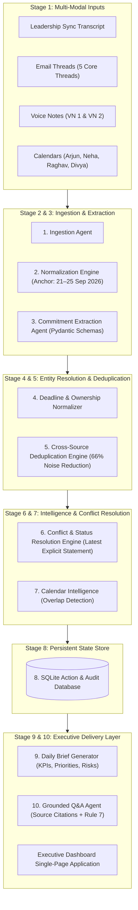

# System Architecture: Executive Productivity Agent — AIONOS

## 1. Executive Overview & Objective
The **Executive Productivity Agent** is an autonomous multi-stage agentic system engineered for **Arjun Malhotra — VP Sales at Veridian Corp** (`arjun.malhotra@veridian-corp.example`).

The system ingests unstructured, multi-modal enterprise communication streams across **meeting transcripts, email threads, voice notes, and calendar events** for the week of **Monday, 21 September 2026 to Friday, 25 September 2026**. It converts them into a daily action brief featuring cross-source deduplication, strict ownership boundaries, temporal conflict resolution, calendar conflict detection, and defensible source citations.

---

## 2. End-to-End Pipeline Architecture



---

## 3. Detailed 10-Stage Pipeline Breakdown

### Stage 1: Multi-Modal Source Ingestion (`IngestionAgent`)
- **Inputs**:
  - `meeting_transcripts`: Leadership Sync (Mon 21 Sep 10:00 AM)
  - `email_threads`: 5 assignment threads (Vendor List, Campaign Deck, Reschedule, Expense Variance, Mumbai Lease)
  - `voice_notes`: Voice Note 1 (21 Sep 6:30 PM) & Voice Note 2 (22 Sep 8:45 AM)
  - `calendars`: Schedules for Arjun, Neha, Raghav, and Divya
- **Responsibility**: Ingests raw document formats into validated canonical structures without data loss.

### Stage 2: Source Normalization (`NormalizerAgent`)
- **Responsibility**:
  - Standardizes participant emails to canonical identities (e.g. `arjun.malhotra@veridian-corp.example`).
  - Anchors the temporal evaluation window to **Monday 21 Sep – Friday 25 Sep 2026**.
  - Establishes the simulated daily brief anchor date: **Wednesday, 23 September 2026**.

### Stage 3: Commitment Extraction (`CommitmentExtractionAgent`)
- **Responsibility**:
  - Uses structured extraction to identify explicit personal promises, requests, deliverables, and assignments.
  - Distinguishes between **first-person commitments** (*"I promise I will send..."*) and **third-party obligations** (*"Divya will send..."*).

### Stage 4: Deadline & Ownership Resolution (`DeadlineOwnershipAgent`)
- **Responsibility**:
  - **Rule 1 (Strict Ownership)**: Classifies commitments into `ARJUN`, `OTHER`, or `UNCLEAR`.
  - **Rule 2 (Deadline Normalization)**: Translates natural language expressions to exact ISO timestamps:
    - `"Wednesday morning"` $\rightarrow$ `2026-09-23T11:00:00` (ahead of 11:00 AM review)
    - `"Wednesday evening"` $\rightarrow$ `2026-09-23T18:00:00`
    - `"Thursday 9:30 AM"` $\rightarrow$ `2026-09-24T09:30:00`
    - `"Friday 5:00 PM IST"` $\rightarrow$ `2026-09-25T17:00:00`

### Stage 5: Cross-Source Deduplication (`DeduplicationAgent`)
- **Problem**: The commitment to *"Send updated vendor list"* appears in:
  1. Leadership Sync (Meeting Transcript)
  2. Vendor List Email Thread (Messages 1, 2, and 3)
  3. Voice Note 1 (Arjun's audio memo)
- **Mechanism**: Clusters semantically identical actions and merges them into **1 consolidated action card** while retaining all 3 source citations in the audit trail (reduces clutter by 66%).

### Stage 6: Temporal Conflict & Status Resolution (`StatusEngine`)
- **Rule 4 (Latest Explicit Evidence Wins)**:
  - **Campaign Deck**: Neha initially planned Wednesday afternoon $\rightarrow$ shifted via email to **Thursday 24 Sep at 9:30 AM** $\rightarrow$ Arjun accepted. System records Thursday 9:30 AM.
  - **Meridian Call**: Priya requested reschedule from Monday $\rightarrow$ Arjun proposed Wednesday 3:00 PM $\rightarrow$ Priya accepted. Meeting confirmed for **Wednesday 23 Sep at 3:00 PM**.
- **Rule 3 (Verified Completion Proof)**:
  - Divya delivered the Expense Variance Report on Wednesday at 5:45 PM and Arjun acknowledged at 6:15 PM $\rightarrow$ Status: **`COMPLETED`** (removed from open waiting items).
  - Arjun has not sent the vendor list past Wednesday morning $\rightarrow$ Status: **`OVERDUE`**.

### Stage 7: Calendar Intelligence (`CalendarAgent`)
- **Responsibility**:
  - Compares meeting intervals on Arjun's calendar for scheduling clashes without silently mutating events.
  - **Conflict Detected**: On Thursday, 24 Sep:
    - `09:00 - 10:00`: Board Prep Session
    - `09:30 - 10:30`: Q3 Campaign Deck Review (Neha)
    - Surfaces high-visibility `⚠️ Calendar Conflict: 30-minute overlap`.

### Stage 8: State & Database Layer (`db.py`)
- **Technology**: SQLite database with ACID compliance.
- **Tables**: `actions`, `calendar_events`, `audit_logs`.
- **Purpose**: Persists structured action objects, historical audit trails, and source cross-references.

### Stage 9: Daily Executive Brief Generator (`brief_service.py`)
- **Responsibility**:
  - Computes executive KPIs (`My Actions`, `Waiting`, `Overdue`, `Unclear Ownership`, `Completed`).
  - Generates the **Needs Action Today** priority panel, **Key Risks**, and **Today's Calendar**.

### Stage 10: Grounded Q&A Agent (`qa_service.py`)
- **Responsibility**:
  - Conversational query interface answering natural language questions grounded strictly in the action database.
  - Enforces **Rule 6** (verbatim source citations for every answer).
  - Enforces **Rule 7** (standard refusal when evidence is absent).

---

## 4. Structured Data Schemas (Pydantic Models)

### ActionItem Schema
```json
{
  "id": "act_vendor_list",
  "action": "Send updated vendor list",
  "owner": "Arjun Malhotra",
  "ownership_status": "ARJUN",
  "stakeholder": "Raghav Sethi",
  "deadline": "Wednesday, 23 September 2026 morning (before 11:00 AM)",
  "normalized_deadline": "2026-09-23T11:00:00",
  "status": "OVERDUE",
  "priority": "High",
  "confidence": "High",
  "sources": [
    {
      "source_id": "meet_leadership_sync_01",
      "source_type": "MEETING",
      "title": "Leadership Sync",
      "date_display": "Monday, 21 Sep 2026, 10:00 AM",
      "quote": "I promise I'll get you the updated vendor list by Wednesday morning...",
      "reference_tag": "[Meeting] Leadership Sync — 21 Sep"
    },
    {
      "source_id": "email_thread_vendor_list",
      "source_type": "EMAIL",
      "title": "Vendor List Email Thread",
      "date_display": "Monday, 21 Sep 2026, 2:15 PM",
      "quote": "On it, Raghav. I will have the updated vendor list sent over to you Wednesday morning without fail.",
      "reference_tag": "[Email] Vendor List Thread — 21–23 Sep"
    },
    {
      "source_id": "vn_01",
      "source_type": "VOICE_NOTE",
      "title": "Voice Note 1",
      "date_display": "Monday, 21 Sep 2026, 6:30 PM",
      "quote": "Quick memo to self: Need to finalize the vendor shortlist for Raghav by Wednesday morning...",
      "reference_tag": "[Voice] Voice Note 1 — 21 Sep"
    }
  ],
  "evidence": [
    "Arjun explicitly promised Raghav in Leadership Sync...",
    "Arjun confirmed via email on Mon 21 Sep at 2:15 PM...",
    "Arjun recorded memo in Voice Note 1...",
    "Latest message: Wed 23 Sep at 8:45 AM from Raghav: 'Just checking — still good for this morning?'"
  ],
  "latest_evidence": "Wed 23 Sep, 8:45 AM: Raghav Sethi asked 'Just checking — still good for this morning?'. No record of delivery.",
  "why_exists": "Direct commitment made by Arjun to Raghav across three separate modalities to unblock operations review.",
  "conflict_note": "Consolidated from 3 distinct sources. Status marked OVERDUE as morning window elapsed with no delivery record.",
  "last_updated": "2026-09-23T08:45:00",
  "deduplication_count": 3
}
```

---

## 5. Seven Hallucination Safeguards

1. **Rule 1 (Never invent an owner)**: If an owner is unconfirmed (e.g. Mumbai lease renewal), explicitly classify as `⚠️ UNCLEAR OWNERSHIP`. Never assign to Arjun.
2. **Rule 2 (Never invent a deadline)**: Normalize dates only within the explicit 21–25 September 2026 week. Never guess unspecified times.
3. **Rule 3 (Never mark completed without proof)**: Require explicit delivery and receipt evidence before marking `COMPLETED`.
4. **Rule 4 (Latest explicit statement wins)**: Chronological ordering ensures recent agreements override earlier estimates.
5. **Rule 5 (Surface unresolved conflicts)**: Explicitly display scheduling clashes and unassigned responsibilities in Key Risks.
6. **Rule 6 (Grounded source citations)**: Every answer and action must display clickable multi-modal citations.
7. **Rule 7 (Refuse without evidence)**: If the dataset does not contain sufficient facts, return: *"I don't have enough evidence in the provided sources to answer that."*

---

## 6. Technology Stack

- **Runtime & Language**: Python 3.11 / 3.13
- **Web & API Framework**: FastAPI 0.115 + Starlette
- **ASGI Server**: Uvicorn with dynamic port fallback
- **Data Validation**: Pydantic v2
- **Database**: SQLite 3
- **Frontend**: Responsive Single-Page Application (SPA) with Tailwind CSS, Lucide icons, and real-time REST integration
- **Testing**: Pytest automated test suite (9 test cases, 100% pass)
- **Presentation Deck**: python-pptx (10 widescreen executive slides)
- **Containerization**: Docker & Docker Compose
